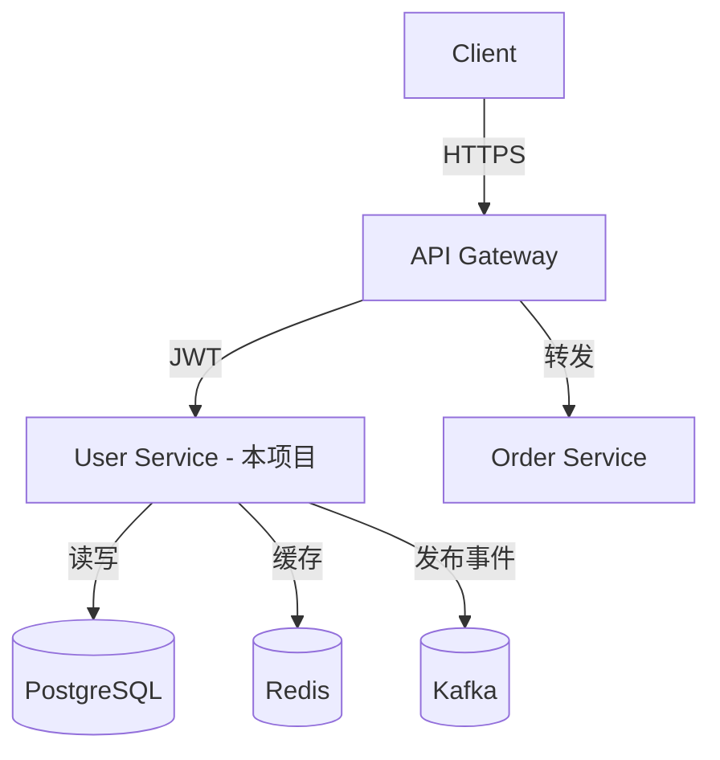

# 项目架构说明

> 本文件是项目级架构规范模板，用于描述本项目特有的架构设计。
> **与团队架构规范的关系：** 本文件补充或覆盖团队层的 `architecture.md`，
> 仅记录本项目与团队通用规范不同的地方，以及项目特有的架构决策。
> 如无差异，可删除相应章节。

---

## 1. 项目架构概述

### 1.1 系统定位

> [填写] 一段话描述本项目在整体系统中的位置和职责，例如：
> 本服务负责用户账户管理，是平台的认证中心，提供注册、登录、权限验证等能力，
> 其他服务通过 gRPC 调用本服务验证 Token。

### 1.2 架构图

> [填写] 系统上下文图或组件图（可用 Mermaid 或文字描述），例如：



### 1.3 与团队架构规范的差异

> [填写] 说明本项目哪些地方与团队通用规范不同及原因，例如：
>
> - 本项目暂不使用 DDD 分层，采用更简单的 3 层架构（Handler → Service → Repository），原因：规模较小，引入 DDD 成本高于收益

---

## 2. 模块划分

### 2.1 核心模块

> [填写] 本项目的主要模块及其职责：

| 模块     | 目录             | 职责       |
| -------- | ---------------- | ---------- |
| [模块名] | `internal/[dir]` | [职责说明] |

### 2.2 模块依赖关系

> [填写] 模块间的依赖关系（禁止的依赖方向）：

```
[模块A] → [模块B]  （允许）
[模块B] -x→ [模块A] （禁止，会产生循环依赖）
```

---

## 3. 关键技术决策

### 3.1 数据库设计约定

> [填写] 本项目特有的数据库约定，例如：
>
> - 使用分区表管理日志数据（按月分区）
> - 用户相关表以 `user_` 前缀，权限相关以 `rbac_` 前缀
> - 所有外键关系在应用层维护，数据库不设 FOREIGN KEY 约束（便于分库分表）

### 3.2 缓存策略

> [填写] 本项目的缓存约定，例如：
>
> - Token 验证结果缓存 5 分钟（TTL），key 格式：`token:{token_hash}`
> - 用户信息缓存 10 分钟，key 格式：`user:{user_id}`
> - 权限数据缓存 1 分钟（强一致性要求较高）

### 3.3 异步处理

> [填写] 异步任务和消息处理约定，例如：
>
> - 用户注册成功后，发布 `user.registered` 事件到 Kafka
> - Topic 命名：`{env}.{domain}.{event}`（如 `prod.user.registered`）
> - 消费者组命名：`{service}-{consumer-name}`

---

## 4. 关键流程说明

### 4.1 [核心流程名称]

> [填写] 本项目最重要的业务流程（如认证流程、订单状态机等），例如：

```
用户登录流程：
1. 接收请求（Handler）
2. 验证参数格式（Handler）
3. 查询用户记录（UserService → UserRepository）
4. 验证密码（UserService）
5. 生成 Token 对（UserService → TokenService）
6. 写入缓存（TokenService → Redis）
7. 返回 Token（Handler）
```

---

## 5. 架构决策记录索引

> [维护] 列出本项目的 ADR 列表，保持更新：

| ADR      | 标题       | 状态   | 日期       |
| -------- | ---------- | ------ | ---------- |
| ADR-0001 | [填写标题] | 已接受 | YYYY-MM-DD |
